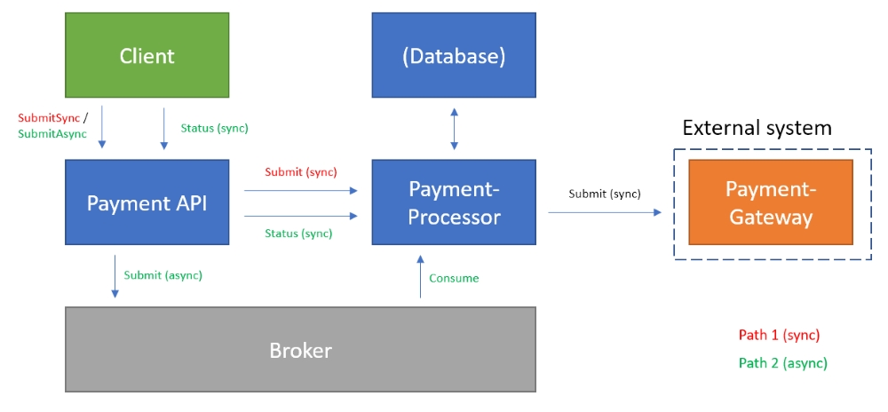

# Payment Processor Demo
This demo exists to minimally explore the concept of transport independence in microservices. Payment processing is a valid scenario because it typically requires long-running tasks for validation and transactions. This architecture shows the value of using a message broker instead of synchronous HTTP, and also seeks to abstract broker publishing and consumption infrastructure code into a reusable component.

## Solution architecture
This solution allows a client to submit payment requests to an API, which invokes a processing app that stores the state of the payment and interacts with an external payment gateway. The architecture is described in this diagram:



## Running the solution
I have set this up to work with Docker Compose in the repository root. While the eventual goal is to run the AMQP Sidecar next to apps in Kubernetes pods, Compose provides a way to get started more quickly.

```
docker-compose up --build -d
```
_Note: currently, the sidecar apps will crash prior to the message broker container coming online. I recommend running the line above a few times to ensure all containers are running._

Example synchronous call:
```
POST http://localhost:3001/submitSync
{
	"accountNumber": "12345",
	"paymentAmount": 100.00
}
```

This call should take about 5 seconds to complete because it waits for the external payment gateway to respond.

Example asynchronous call: 
```
POST http://localhost:3001/submitAsync
{
	"accountNumber": "12345",
	"paymentAmount": 100.00
}
```

This call should be nearly instantaneous, but note that the `"Status": "Pending"`. This is because the message has been passed to the broker, but work has not yet been completed. Call the following to see the completed call:

```
GET http://localhost:3001/{paymentId}
```

## AMQP Sidecar
In the latter asynchronous scenario, all of the broker communication is handled by an AMQP Sidecar app. This accomplishes a few different goals:

- __Messaging cohesion__ - the Payment API and Payment Processor apps are HTTP-only, which makes testing easier. It's difficult to test when messages are sent to an AMQP broker, but in this case I have more general observability.
- __Transport independence__ - the only difference between the synchronous and asynchronous paths is the URI. The messages are the same, and the functionality is configured at application runtime instead of during development.
- __Reusable infrastructure code__ - all of the broker infrastructure code is no longer a concern or dependency of the applications, so they can focus on what they're good at: delivering business value.

Here is a diagram of how messages flow with the AMQP Sidecar:


The Payment API and Payment Processor apps can continue to rely on the HTTP protocol, but still achieve the benefits of a decoupled and resilient architecture.